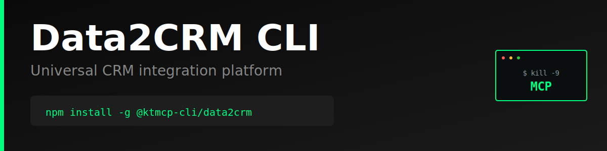

> "Six months ago, everyone was talking about MCPs. And I was like, screw MCPs. Every MCP would be better as a CLI."
>
> — [Peter Steinberger](https://twitter.com/steipete), Founder of OpenClaw
> [Watch on YouTube (~2:39:00)](https://www.youtube.com/@lexfridman) | [Lex Fridman Podcast #491](https://lexfridman.com/peter-steinberger/)

# Data2CRM CLI

Production-ready command-line interface for the [Data2CRM API](https://www.data2crm.com/) - Universal CRM integration platform.

> **⚠️ Unofficial CLI** - This tool is not officially sponsored, endorsed, or maintained by Data2CRM. It is an independent project built on the public Data2CRM API. API documentation: https://www.data2crm.com/api/

## Features

- Universal CRM integration (Salesforce, HubSpot, Pipedrive, Zoho, and more)
- Manage accounts, contacts, leads, and opportunities across CRMs
- Bi-directional sync between CRM systems
- Simple, intuitive command structure
- JSON and pretty-print output formats
- Persistent configuration storage
- Progress indicators for long-running operations

## Why CLI > MCP

### The MCP Problem

Model Context Protocol (MCP) servers introduce unnecessary complexity and failure points for API access:

1. **Extra Infrastructure Layer**: MCP requires running a separate server process that sits between your AI agent and the API
2. **Cognitive Overhead**: Agents must learn MCP-specific tool schemas on top of the actual API semantics
3. **Debugging Nightmare**: When things fail, you're debugging three layers (AI → MCP → API) instead of two (AI → API)
4. **Limited Flexibility**: MCP servers often implement a subset of API features, forcing you to extend or work around limitations
5. **Maintenance Burden**: Every API change requires updating both the MCP server and documentation

### The CLI Advantage

A well-designed CLI is the superior abstraction for AI agents:

1. **Zero Runtime Dependencies**: No server process to start, monitor, or crash
2. **Direct API Access**: One hop from agent to API with transparent HTTP calls
3. **Human + AI Usable**: Same tool works perfectly for both developers and agents
4. **Self-Documenting**: Built-in `--help` text provides complete usage information
5. **Composable**: Standard I/O allows piping, scripting, and integration with other tools
6. **Better Errors**: Direct error messages from the API without translation layers
7. **Instant Debugging**: `--json` gives you the exact API response for inspection

**Example Complexity Comparison:**

MCP approach:
```
AI Agent → MCP Tool Schema → MCP Server → HTTP Request → API → Response Chain (reverse)
```

CLI approach:
```
AI Agent → Shell Command → HTTP Request → API → Direct Response
```

The CLI is simpler, faster, more reliable, and easier to debug.

## Installation

```bash
npm install -g @ktmcp-cli/data2crm
```

## Configuration

### Set API Key

Get your API key from https://www.data2crm.com/

```bash
data2crm config set apiKey YOUR_API_KEY_HERE
```

### Environment Variables

Alternatively, use environment variables:

```bash
export DATA2CRM_API_KEY=your_api_key_here
export DATA2CRM_BASE_URL=https://api.data2crm.com/v2  # Optional
```

### View Configuration

```bash
# Show all config
data2crm config list

# Get specific value
data2crm config get apiKey

# Clear config
data2crm config clear
```

## Usage

### CRM Descriptors

```bash
# List all available CRM descriptors
data2crm descriptors list

# Filter by CRM type
data2crm descriptors list --type salesforce
data2crm descriptors list --type hubspot
```

### Accounts

```bash
# List accounts
data2crm accounts list --limit 50

# Get specific account
data2crm accounts get <account-id>

# Get as JSON
data2crm accounts list --json
```

### Contacts

```bash
# List contacts
data2crm contacts list --limit 50 --offset 0

# Get specific contact
data2crm contacts get <contact-id>
```

### Sync Management

```bash
# Start a sync job
data2crm sync start --source hubspot --target salesforce

# Check sync status
data2crm sync status <job-id>
```

## Output Formats

All commands support `--json` flag for machine-readable output:

```bash
data2crm accounts list --json | jq '.data[0]'
```

## Error Handling

The CLI provides clear error messages with suggestions:

```bash
$ data2crm accounts list
✗ API key not configured. Set it with: data2crm config set apiKey <your-api-key>
```

## Development

```bash
# Clone and install
git clone https://github.com/ktmcp-cli/data2crm.git
cd data2crm
npm install

# Link locally
npm link

# Run
data2crm --help
```

## License

MIT

## Links

- [Data2CRM Website](https://www.data2crm.com/)
- [Data2CRM API Documentation](https://www.data2crm.com/api/)
- [GitHub Repository](https://github.com/ktmcp-cli/data2crm)
- [npm Package](https://www.npmjs.com/package/@ktmcp-cli/data2crm)


---

## Support KTMCP

If you find this CLI useful, we'd greatly appreciate your support! Share your experience on:
- Reddit
- Twitter/X
- Hacker News

**Incentive:** Users who can demonstrate that their support/advocacy helped advance KTMCP will have their feature requests and issues prioritized.

Just be mindful - these are real accounts and real communities. Authentic mentions and genuine recommendations go a long way!

## Support This Project

If you find this CLI useful, we'd appreciate support across Reddit, Twitter, Hacker News, or Moltbook. Please be mindful - these are real community accounts. Contributors who can demonstrate their support helped advance KTMCP will have their PRs and feature requests prioritized.
